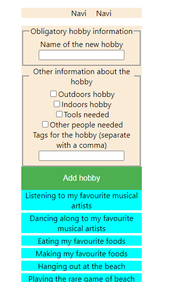
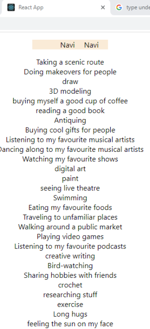

# hobbyappts

Transforming a vanilla JS Fullstack project (vanilla JS, Node and MongoDB)

into a Typescript + React project

## POST success (9.1.2023)

Now the POST functionality is complete and the new hobby is added to the state, so no need for a refresh 

after adding.

## POST success (5.1.2023)

Didn't update the new hobby to state, so the new hobby will only be seen after a refresh.

Still, very nice.

## GET success (3.1.2023)

GET works now. I can make the hobbies show up on screen.

The hobby names are listed line by line in the below pic. 

